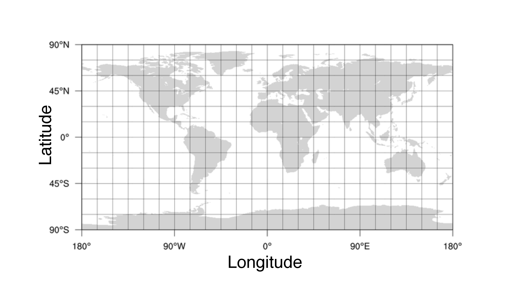

# Introduction to GIS
#### Rhett M. Rautsaw

Geographic Information System (GIS) is a framework for gathering, managing, visualizing, and analyzing spatial data. There are many GIS softwares and applications available, the most common of which is [ESRI ArcGIS](https://www.esri.com/en-us/arcgis/products/arcgis-pro/overview). Although widely-used and powerful, ArcGIS is only available on Windows computers and is expensive (although your university may offer it for free). 

[qGIS](https://www.qgis.org/en/site/) and [R](https://www.r-project.org/) are two alternate **free** open-source softwares you can use to analyze and manage GIS data. 

Here, I will briefly go over the basics of GIS, qGIS, and R and give you all the tips and tricks I have learned. However, there are much more extensive tutorials found elsewhere (*e.g.*, [qGIS Documentation](https://docs.qgis.org/3.10/en/docs/gentle_gis_introduction/index.html)). 

On this page, you will find the general introduction to GIS including useful resources to explain GIS concepts and a long list of data/analysis resources at the bottom of the document.

You can find the tutorials here:

- [qGIS Tutorial](https://github.com/reptilerhett/GIS_Tutorial/blob/master/qGIS_Tutorial.md)
- [R Tutorial](https://github.com/reptilerhett/GIS_Tutorial/blob/master/R_Tutorial.md)

To download the necessary data for either tutorial, you can clone or download this repository: 

```
git clone https://github.com/reptilerhett/GIS_Tutorial.git
```

## Types of Data

There are two main types of GIS data called Vectors and Rasters. Both feature types can generally be thought of as very complex spreadsheets, where each row corresponds to a feature containing the geographic extent of that feature and other attributes associated with it. For example, a feature can have attributes like an ID number, group with which that feature is associated (*e.g.*, species), population density, depth, elevation, etc. The possibilities are limitless. 

So what are the differences between Vectors and Rasters?

### Vector Data

Vector data are geographical features expressed as geometrical shapes. Most importantly Vectors have discrete/distinct boundaries. Vector data include:

- Points
	- Zero-dimensional features used to show a location.
- Lines/Polylines
	- One-dimensional features used to trace linear features such as roads, trails, rivers, etc. 
	- These can be used to measure distance.
- Polygons/Multi-part Polygons
	- Two-dimensional features used to cover a particular area to indcate boundaries.
	- These can be used to measure area/perimeter.

**The Most Common Vector Data Formats:**

- Delimited Text Files
	- `.csv`, `.txt`, or `.tab`
	- This is the most obvious, but warrants addressing.
	- This is a common file format for point data specifically. Delimited text files can be read by any software. 
- ESRI Shapefiles
	- `.shp`, `.dbf`, and `.shx`
	- The most common file format.
	- These can be read by nearly any program, but they are a little bit of a pain to transfer anywhere because they come as three separate files which require one another to work properly. So be ready to make a lot of zip files or ESRI geodatabases (Although I would recommend avoiding ESRI specific anything)
- Geographic JavaScript Object Notation
	- `.json` or `.geojson`
	- The most common open-source file format outside of shapefiles.
	- These similarly can be read by nearly any program and are a little easier to work with in one regard because they are only one file. However, because it is only one file it is generally a little larger. So it may take a program a little longer to load. 
- ESRI Geodatabases
	- `.gdb` or `.mdb`
	- An ESRI-specific folder-like format for storing a sets of shapefiles and other features.
	- There are three different types which I will not get into because I generally recommend avoiding these, but you might encounter them. 
	- If you decide to use them, the file geodatabase is what you want to use. You can learn more about them [here](https://desktop.arcgis.com/en/arcmap/latest/manage-data/geodatabases/types-of-geodatabases.htm).
- Google Keyhole Markup Language
	- `.kml` or `.kmz`
	- This format is used by Google Earth.
	- Google Earth is another GIS software, but offers far less utilities than others. Nonetheless, you may encounter this format. This will likely require a specific tool to be read by `ArcMap` or `qGIS` 
- GPS eXchange Format
	- `.gpx`
	- This format is used by mobile/handheld GPS units. So if you collect data with these devices, you will likely export this format from your device. Most softwares 

To put it bluntly, GIS data is chaos. While these are the most common formats, they are by no means the **only** formats. A more extensive list can be found [here](https://en.wikipedia.org/wiki/GIS_file_formats). `qGIS` should be able to read the formats listed [here](https://gdal.org/drivers/vector/index.html)

### Raster Data

Raster data are represented by grids; a series of adjacent squares -- also known as grid cells or pixels -- of equal area. Rasters are most beneficial for data without discrete/distinct boundaries (unlike Vectors) and data that has continuous change across a landscape such as precipitation, elevation, slope, and other landscape-wide environmental data. 

The size of each pixel is dependent on our ability to collect the corresponding data. For example, lets think about the photos you take on your phone. Photos are nothing more than rasters without geographic information. Each photo is grid with each pixel taking a specific value to form an image when viewed together. If you take photo of an object with your phone, that object is represented by a series of 12 million pixels (assuming you have a 12MP camera). But if you take the same picture with a very fancy, professional camera, you could capture an image composed of >60 million pixels. Same image, but with your phone each pixel takes up a larger amount of space creating a blurrier image than the professional camera. We call this having a lower/higher resolution image. 

This concept extends to geographic raster data when we collect environmental data with different equipment orbiting the Earth or with different data stations on the surface of the Earth. 

**The Most Common Raster Data Formats:**

- GeoTIFF
	- `.tif` or `.tiff`
	- This is by far the most common format for raster data and is essentially a picture, but with some extra information on the geographic extent of that picture. 
	- There may be some supplemental files that accompany these files, but generally not required. For example `.ovr` may contain some information regarding how to display the data. 
- Delimited Text Files
	- `.csv`, `.txt`, or `.tab`
	- Not super common for Rasters, but it is possible for Rasters to be represented by regularly spaced points instead of pixels and converted into pixels later.
- GDAL Virtual Format (VRT)
	- `.vrt`
	- This is actually just a stitching format. This format is accompanied by a large folder of GeoTIFFs and the VRT provides instructions with how to stitch those GeoTIFFs together. 
	- These can be a giant pain to work with, so hope that you never see these. The reason they exist is to be able to download pieces rather than a absurdely large database. For example SoilGrid offers 250m x 250m rasters (which is very high resolution). A single GeoTIFF would take up >100 GB of space, which as you can imagine can be difficult to work with. 
	- VRT can be converted to a massive GeoTIFF using `gdal_translate in.vrt out.tif`

Much like Vector data, Raster GIS data is also chaos. While these are the most common formats, they are by no means the **only** formats. A more extensive list can be found [here](https://en.wikipedia.org/wiki/GIS_file_formats). `qGIS` should be able to read the formats listed [here](https://gdal.org/drivers/raster/index.html)

 

[Image Source](http://gsp.humboldt.edu/OLM_2017/Lessons/GIS/08%20Rasters/RasterToVector.html)

## Coordinate Reference Systems and Projections

Like any other type of data, spatial data has a set of X and Y coordinates. The **Y** coordinate is commonly known as *Latitude* or the *Northing* value. The **X** coordinate is commonly known as *Longitude* or the *Easting* value. It's important to note that even though coordinates are often wrote as (Latitude, Longitude):

X = Longitude and Y = Latitude



These YX coordinates are what gets plotted onto a map to create the vectors and rasters described above. So you might ask, why is there software specifically dedicated to spatial data (GIS)? Can't we just make a scatterplot? 

Hopefully you know that our planet is spherical or a globe. The problem with spatial data is that the X,Y coordinates are not the same as 2D scatterplot because we need to account for the curvature of our 3D Earth.

Unfortunately, displaying the globe as a map in 2D space is mathematically impossible without some level of distortion. Therefore, mathematicians, scientists, and cartographers have developed a massive library of different **Projections** and corresponding **Coordinate Reference Systems (CRS)** which are useful for different purposes. The library of spatial coordinate systems is kept and organized by the [EPSG Database](https://epsg.org/home.html) where each CRS and Projection is given a unique identifier (*e.g.*, WGS84 = EPSG:4326). I'd recommend watching this video for a more visual demonstration on the difficulties of projecting a globe onto 2D space and the library of alternate CRS and Projections.

[Why All Maps Are Wrong](https://youtu.be/kIID5FDi2JQ)

In addition, qGIS offers a great page explaining **Projections** and **CRS**. I highly recommend reading through this page because these concepts -- while the most frustrating part of GIS -- are also central to it's implementation. So it is important for you to have a good understanding of it. 

[qGIS: Coordinate Reference Systems](https://docs.qgis.org/3.10/en/docs/gentle_gis_introduction/coordinate_reference_systems.html)

### Geographic and Projected Coordinate Reference Systems

There are two types of Coordinate Reference Systems, Geographic (GCS) and Projected (PCS). These two types work together to make a map. Briefly, a GCS defines *where* a point is located on the Earth's surface while the PCS defines *how* to draw that point in 2D space. 

ESRI offers a more detailed good explaination: [Geographic vs Projected Coordinate Systems](https://www.esri.com/arcgis-blog/products/arcgis-pro/mapping/gcs_vs_pcs/). 

####  Geographic Coordinate System

The most common GCS is [WGS84 or EPSG:4326](https://en.wikipedia.org/wiki/World_Geodetic_System). This is a global coordinate system and represents the default for most phones, GPS units, Google Maps, GIS softwares, etc. Basically everything.

Nonetheless, you will occassionally encounter data that has been collected in a different GCS because they may be more accurate on a local scale or for different parts of the globe. For example, [NAD83 (EPSG:4269)](https://en.wikipedia.org/wiki/North_American_Datum) is commonly used for North America. Although the differences between these two systems is minimal, it is important to pay attention to what GCS the data was collected (you can change this in GPS units) so that you can inform GIS when importing the data. 

#### Projected Coordinate System 

Next, a PCS is used to define how to draw a point in 2D space. By default most GIS softwares will have a default projection known as a pseudo-projection. However, because everything is plotted in angular degrees, it distorts areas, angles, and distances. So if you are performing analyses or measurments, it's important to actually project your data into an appropriate projection. The most common is a Mercator Projection and is what you will see on Google Maps and many other maps ([EPSG:3857](https://epsg.io/3857)). However, if you watched the video link above, you might remember that a Mercator projection distorts size a lot, so you may want to choose a different projection. All GIS tools offer ways to reproject your data different ways. 

Another common projection and data format is the Universal Transverse Mercator (UTM) which divides the Earth into 60 equal zones from east to west with each zone being 6 degrees wide. This reduces the distortion in each zone, but can be challenging due to the coordinate format being difficult to interpret and relative to each of the different 60 different zones.  

#### Coordinate Formats

**Degrees of Latitude and Longitude**

Let's talk about YX coordinates again and how these data are represented. Under WGS84 (and most GCS systems), coordinates are collected in terms of degrees of latitude and longitude. Also known as parallels, lines of latitude (**Y**) run parallel to the equator and divide the earth into 180 equally spaced sections to the north and south. Because lines of latitude run parallel, the distance between the lines of latitude is the same. One degree increase in latitude is equivalent to 60 nautical miles regardless of geography. So if I say that I'm at 10° latitude, you know that I'm exactly 600 nautical miles away from the equator. 

Lines of longitude (**X**), also known as meridians, are not quite as nice because they do not run parallel to one another. Instead, they are perpendicular to the equator and converge with each other at the poles. One of these lines is known as the prime meridian and -- similar to the equator -- represents the 0 value for longitude from which additional lines are found east and west. At the Equator (and **ONLY** at the equator), the distance bewteen lines of longitude are equal to the distance between lines of latitude (60 nautical miles). However, because they converge at the poles, the distance between lines of longitude decrease as you move towards the poles or away from the equator. 

For example, if I'm at 0° latitude (on the equator) and at 10° longitude, you know that I'm exactly 600 nautical miles away from the prime meridian. However, if I am 10° latitude and 10° longitude then I am still 600 nautical miles from the equator, but I'm now only 591 nautical miles away from the prime meridian. At 80° latitude, 10° longitude, I'm now only 104 nautical miles away from the prime meridian. Etc.

Hopefully this illustrates the complexity of spatial data and the need for CRS and GIS-specific software. 

**Degree Subdivision** 

Each line of latitude and longitude forms a fairly large rectangle of geographic space. So how do you get more fine scale representation? 

Easy, you either use decimal degrees (10.51°, 71.32°) or divide your degrees into minutes `'` and seconds `"` where each degree is made of 60 minutes and each minute is made of 60 seconds (10° 30' 36", 71° 19' 12"). Degrees minutes seconds format I find to be annoying, so I recommend using decimal degrees whenever possible.

**Hemispheres**

Finally, all of my values have been represented by positive values. Therefore, traveling north of the equator and east of the prime meridian. However, because the equator and prime meridian represent dividing lines. It is also possible to travel south and west. This is represented in one of two ways:

1. Negative values: (-10.51°, 71.32°) represents 10 degrees south and 71 degrees east. 
2. Letters: (10.51°S, 71.32°E)

**UTMs**

As mentioned in the PCS section, UTMs are difficult to interpret. Coordinates are recorded as the distance (in meters) from the equator and the central meridian of each zone. Although this sounds intuitive (assuming you know where the zones are), UTMs cannot have negative values. Therefore, south and west values are actually represented by "false-northing" and "false-easting" values where the negative values have false northing values (10,000,000 m) and false-easting values (500,000 m) added to them. [qGIS CRS](https://docs.qgis.org/3.10/en/docs/gentle_gis_introduction/coordinate_reference_systems.html#figure-geographic-crs).

**Things to watch out for**

When working with spatial data you need to be mindful of:

1. Coordinate Order: (Latitude, Longitude) or (Longitude, Latitude)
2. Coordinate System: WGS84 or NAD83 or other
3. Coordinate Format: Decimal degrees or degrees minutes seconds
4. Projections/Alternate Formats: Universal Transverse Mercator (UTM)?


# GIS Resources

Additional lists of resources:

- [SDMToolbox Resources](http://www.sdmtoolbox.org/resources)
- [Wikipedia](https://en.wikipedia.org/wiki/List_of_GIS_data_sources)
- [GIS Geography](https://gisgeography.com/best-free-gis-data-sources-raster-vector/)

## Training

- [GIS in R](https://www.nickeubank.com/gis-in-r/)
- [SWIRL: Learn R in R](https://swirlstats.com/)
- [ArcGIS on Mac](https://www.esri.com/arcgis-blog/products/arcgis-pro/3d-gis/arcgis-pro-in-mac-os-x/?rmedium=redirect&rsource=blogs.esri.com/esri/arcgis/2016/03/08/arcgis-pro-in-mac-os-x)
- [Spatial Data Science with R](https://rspatial.org/index.html)
- [CRS in R](https://www.nceas.ucsb.edu/sites/default/files/2020-04/OverviewCoordinateReferenceSystems.pdf)

## Data

### Species Occurrence Records
- [GBIF](https://www.gbif.org/)
- [iDigBio](https://www.idigbio.org/)
- [iNaturalist](https://www.inaturalist.org/)
- [VertNet](http://vertnet.org/)
- [Bison](https://bison.usgs.gov/)
- [HerpMapper](https://www.herpmapper.org/)
- [OBIS](https://obis.org/)
- [ORNIS](http://www.ornisnet.org/)
- [eBird](https://ebird.org/home)
- [SpeciesLink](http://splink.cria.org.br/project?criaLANG=en)

### Shapefiles
- [GADM World/Country/Subdivisions](https://gadm.org/index.html)
- [Natural Earth](http://www.naturalearthdata.com/)
- [TIGER/Line Shapefiles](https://www.census.gov/geographies/mapping-files/time-series/geo/tiger-line-file.html)
- [Florida Geographic Data Library](https://www.fgdl.org/metadataexplorer/explorer.jsp)
- [IUCN Range Maps](https://www.iucnredlist.org/resources/spatial-data-download)

### Raster Data
- [WorldClim](http://www.worldclim.org/)
- [BioClim](https://www.worldclim.org/data/bioclim.html)
- [EarthEnv](http://www.earthenv.org/)
- [SoilGrids](https://soilgrids.org/)
- [PaleoClim](http://paleoclim.org/)
- [CHELSA Climate Data](http://chelsa-climate.org/)
- [Climond](https://www.climond.org/)
- [EarthExplorer](https://earthexplorer.usgs.gov/)
- [ISRIC: Wise30 Soil](https://data.isric.org/geonetwork/srv/eng/catalog.search#/home)
- [Geomorpho90m](https://portal.opentopography.org/dataspace/dataset?opentopoID=OTDS.012020.4326.1)

### General
- [ESRI Open Data Hub](https://hub.arcgis.com/search)
- [OpenStreetMap](https://www.openstreetmap.org/#map=5/38.007/-95.844)
- [NOAA](https://coast.noaa.gov/dataviewer/#)
- [NASA EarthData](https://earthdata.nasa.gov/)
- [United States Interagency Elevation Inventory](https://coast.noaa.gov/inventory/)
- [Open Topography](https://opentopography.org/)
- [USGS Gap Analysis Project](https://www.usgs.gov/core-science-systems/science-analytics-and-synthesis/gap)
- [USGS GIS Data](https://www.usgs.gov/products/maps/gis-data)
- [LIDAR Online 2.0](https://www.lidar-online.com/)
- [qGIS Basemaps](https://raw.githubusercontent.com/klakar/QGIS_resources/master/collections/Geosupportsystem/python/qgis_basemaps.py)


## Analysis
- [SDMToolbox](http://www.sdmtoolbox.org/)
- [Geospatial Modeling Environment (GME)](http://www.spatialecology.com/gme/)
- [CorridorDesign](http://corridordesign.org/)
- [R CoordinateCleaner](https://github.com/ropensci/CoordinateCleaner)
- [R scrubr](https://recology.info/2016/03/scrubr/)
- [R spocc](https://github.com/ropensci/spocc)
- [mgaynor1::Cleaning Occurrence Records Tutorial](https://github.com/mgaynor1/CURE-FL-Plants)


