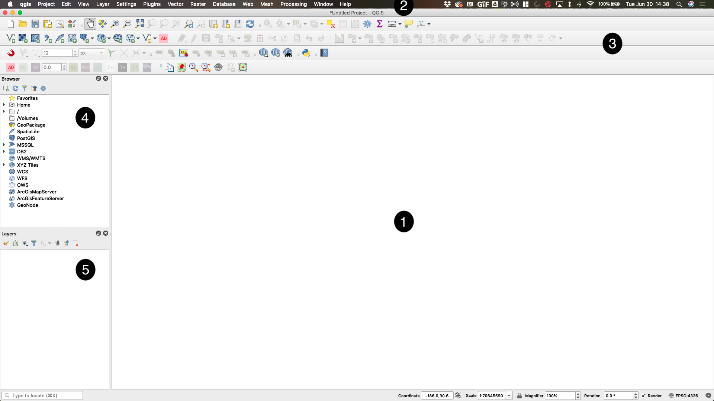
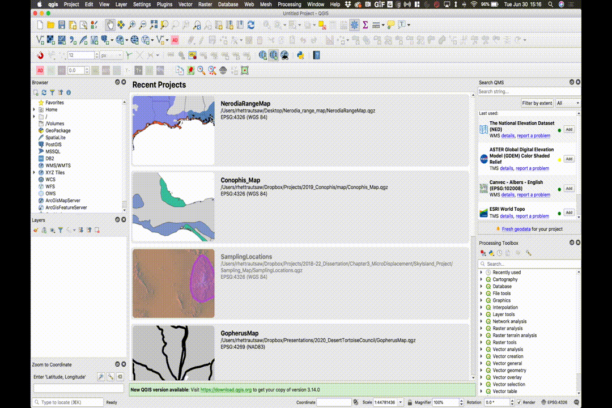
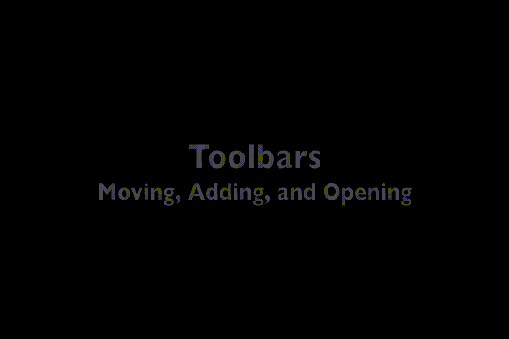
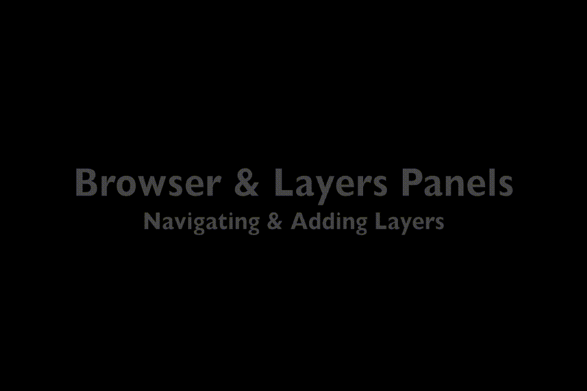
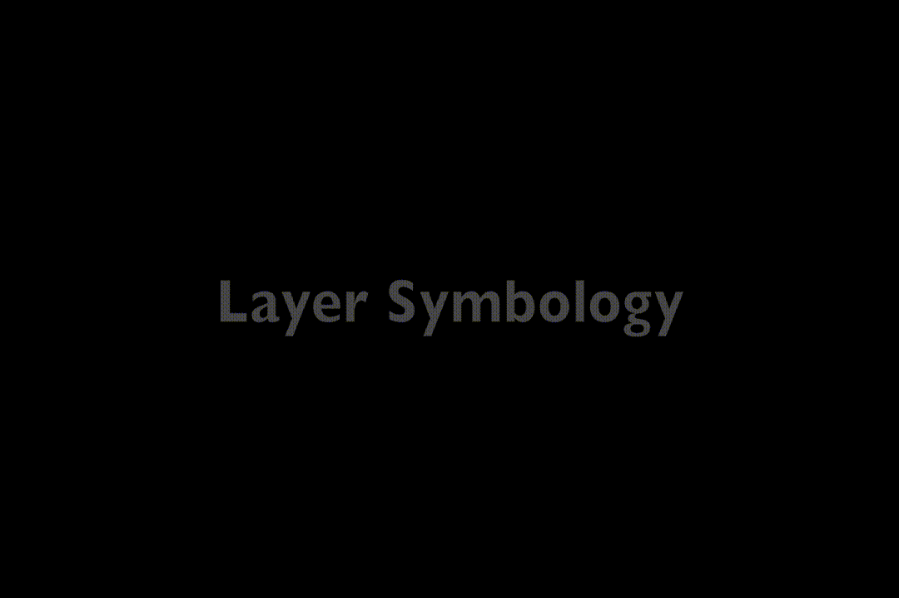
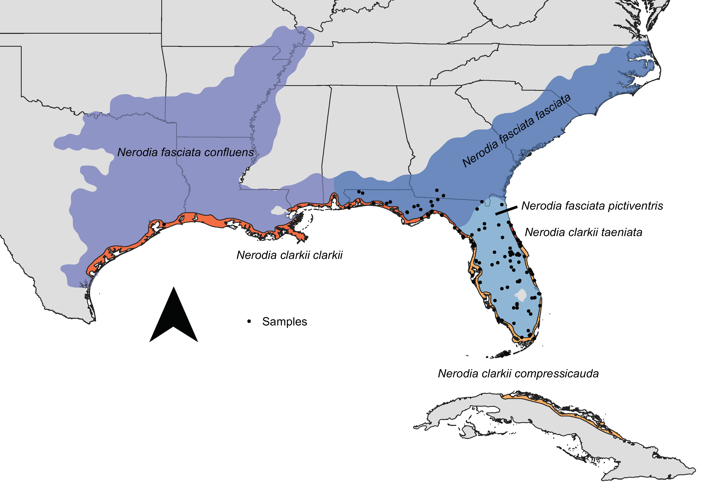
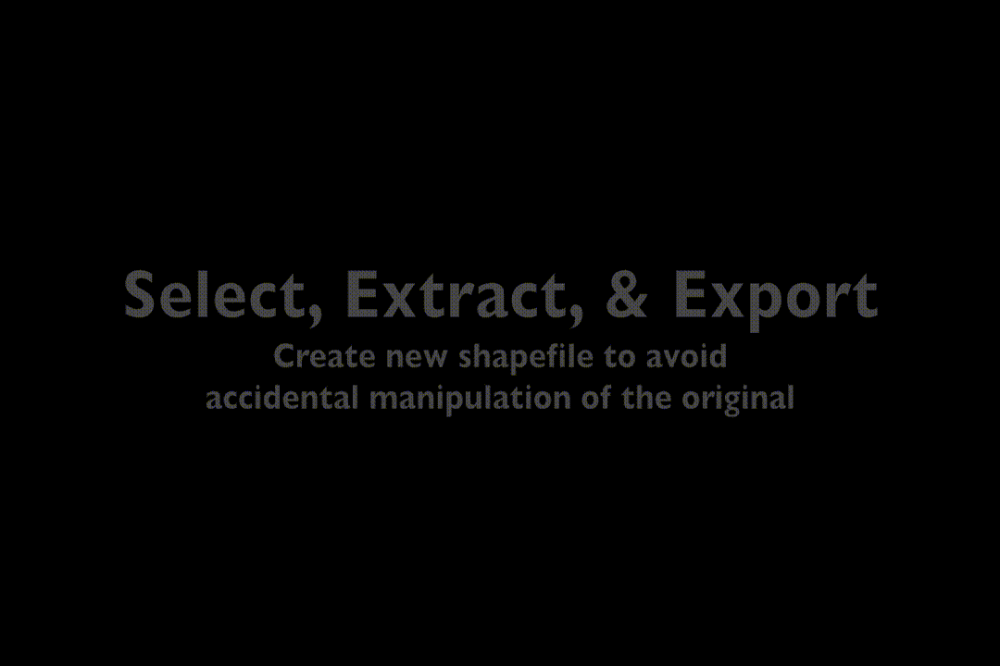
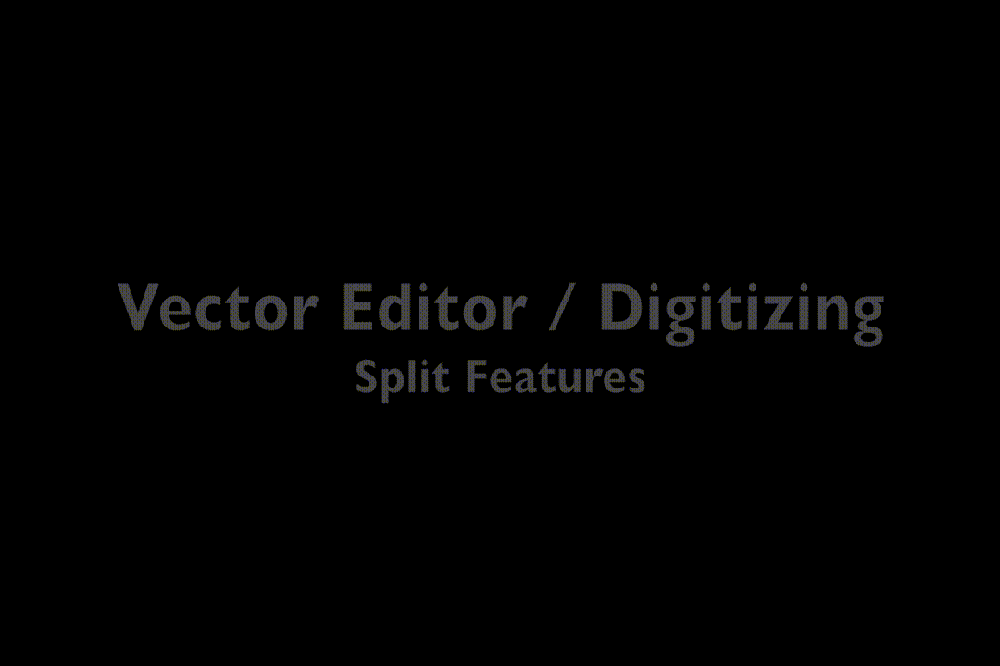
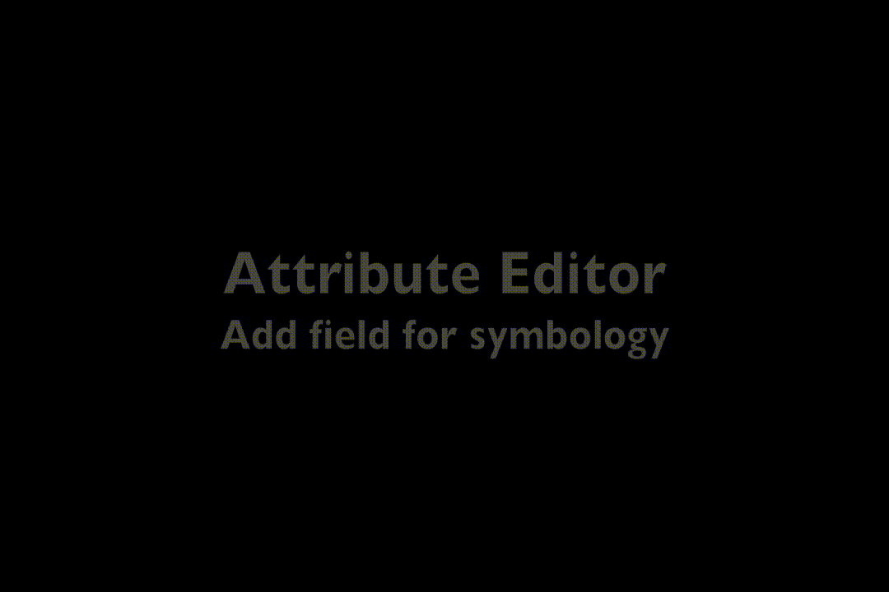
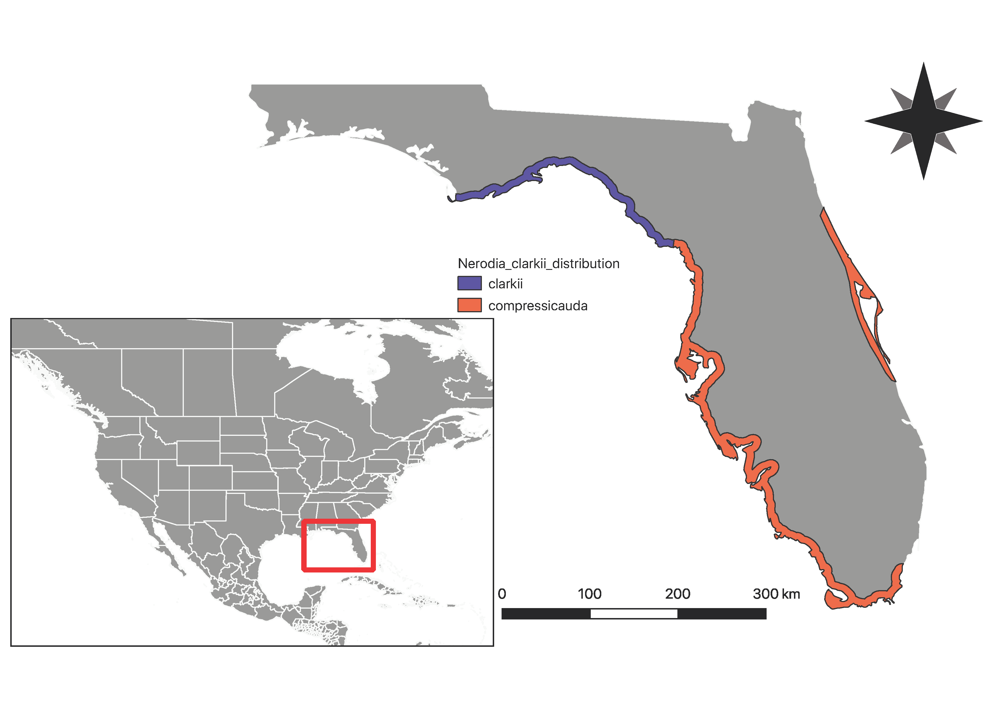

# QGIS Workshop/Tutorial
## Rhett M. Rautsaw


QGIS stands for Quantum Geographic Information Systems and is an open-source software which has many similarities with ArcGIS. However, I've found it is generally faster and accessible on nearly any platform for **free**. Furthermore, because it is open-source, the community as a whole is able to develop and make updates to it at a much quicker pace. 

# Table of Contents
- [Introduction](#Introduction)
- [Installing QGIS](#Installing-QGIS)
- [Launching QGIS](#Launching-QGIS)
- [QGIS Interface](#QGIS-Interface)
	- [Mapping Window](#1.-Mapping-Window)
	- [QGIS Menu](#2.-QGIS-Menu)
	- [Toolbars](#3.-Toolbars)
	- [Panels (Loading Data)](#4.-Browser-Panel)
- [Basic Map Making and Tools](#Basic-Map-Making-and-Tools)
	- [Select and Extract](#Select-and-Extract)
	- [Create New Layer](#Create-New-Layer)
	- [Processing Toolbox](#Processing-Toolbox)
	- [Vector Editor and the Digitizing Toolbar](#Vector-Editor-and-the-Digitizing-Toolbar)
	- [Attribute Editor](#Attribute-Editor)
	- [Adding Text-Delimited Files](#Adding-Text-Delimited-Files)
	- [Temporary/Scratch Layers](#Temporary/Scratch-Layers)
	- [Print Layout/Layout Manager](#Print-Layout/Layout-Manager)
- [Advanced Map Making and Tools](#Advanced-Map-Making-and-Tools)
	- [Georeferencing](#Georeferencing)
	- [SQL](#SQL)
	- [Raster Analysis](#Raster-Analysis)
	- [Interpolation](#Interpolation)
	- [Spatial Autocorrelation](#Spatial-Autocorrelation)
	- [Graphical Models](#Graphical-Models)

# Installing QGIS

It is probably easiest to install QGIS through [Anaconda](https://www.anaconda.com/products/individual) because it requires a version of Python that may clash with other softwares on your computer. By placing into it's own `conda` environment, you are able to update it without interfering with these other softwares. 

Open up `Terminal` or your command line and type:

```
conda create -n qgis_env qgis
```

If you are on a Windows or Linux (or if you monsters don't want to use Anaconda), then it shouldn't be too  hard to download and install from the website: [QGIS](https://www.qgis.org/en/site/). However, you're on your own. Good luck!


# Launching QGIS

If you installed QGIS with Anaconda, you launch it by first activating your environment and then just type qgis. 

```
conda activate qgis_env
qgis

# You can also add an alias to your .bash_profile so that by just typing qgis, it will do these two things.
echo "alias qgis=\"conda activate qgis_env; qgis\"" >> ~/.bash_profile
```

If you installed QGIS manually, then you should have a desktop icon that you can click on and launch.

 


# QGIS Interface

 

## 1. Mapping Window

This is where your map will appear when you start adding data. When you first launch QGIS, you may see "Recent Projects" here that you can easily open to start work on a previously saved project.

## 2. QGIS Menu

Like any application, QGIS has a set of menus where you can find utilities like save, open, etc. Feel free to explore these click down menus, but most of the items in these menus can be accessed from *Toolbars* (see item 3). 

Using the QGIS menu, lets install some plugins from the `Plugins` menu. Plugins are just additional tools that you can install to make working in QGIS better. For example the `QuickMapServices` plugin is a database of basemaps that you can use as the underlying layer for your map (*e.g.*, A Google Map, terrain map, etc.). To install plugins, just go to `Plugins > Manage and Install Plugins...`. 

Search for and install the following plugins:

- Freehand raster georeferencer
- Lat Lon Tools
- QuickMapServices

 

QGIS is based in *Python*, so in the `Plugins` menu you will also find the `Python Console`. If you know *Python*, then you can manipulate GIS data in QGIS using only the `Python Console`. Go ahead an launch the `Python Console` and we will use it to load some additional basemaps....

In this repository is a script called, `qgis_basemaps.py`. You can copy and paste this code into the `Python Console` to load some basemaps into an easily accessible location (I will show you later). The original source of this script is [https://github.com/klakar/QGIS_resources](https://raw.githubusercontent.com/klakar/QGIS_resources/master/collections/Geosupportsystem/python/qgis_basemaps.py).

## 3. Toolbars

Toolbars are easily accessible menus that hold organized sets of tools you will use to manipulate or view GIS data. For example, you can open new QGIS projects, save current projects, open existing projects, pan you map (hand), zoom into a given region (magnifying glass +), etc.

Toolbars can be moved around using the dotted sections on the left side of each toolbar. They can even be moved to the sides or bottom of the window to fit your preferences. 

In my QGIS window, you will see four rows of toolbars. You may have less or you could have more, but you can add/remove toolbars from sight by right clicking in this region.  

Go ahead and check on the following Toolbars:

- Advanced Digitizing Toolbar
- Attributes Toolbar
- Digitizing Toolbar
- Freehand raster georeferencing
- Label Toolbar
- Lat Lon Tools Toolbar
- Manage Layers Toolbar
- Map Navigation Toolbar
- Plugins Toolbar
- Project Toolbar
- Raster Toolbar
- Snapping Toolbar
- Web Toolbar

In addition, do the following things:
 
 - Click the Gear to open the Processing Toolbox *panel*. 
 - Click the Globe in the Web Toolbar to open the `Search QMS` (QuickMapServices) *panel*.



## 4. Browser Panel

The Browser Panel is a window where you will find your computer's folders. Here you can navigate to specific folders and directly drag shapefiles and other data into QGIS mapping zone or *Layers Panel* (see item 5). 

For example, go download the States/Provinces data from [NaturalEarth](https://www.naturalearthdata.com/downloads/10m-cultural-vectors/) and place this zip file into the data folder from this repository. Afterwards, you will be able to navigate to that folder from the Browser Panel and even inside the zip file! Drag the `.shp` file to the mapping window or *Layers Panel* (see item 5). 

Congrats! You've just plotted your first polygon vector shapefile. This works for any `.shp` file (including points, lines, and polygons) and many other formats as well (*e.g.*, `.geojson`). You can also add data using the `Manage Layers Toolbar` or by going to `Layer > Add Data` in the QGIS menu. 

The Browser Panel is also where you will find those basemaps we installed from the `Python Console`. Specifically, navigate to the folder called `XYZ` and drag in one of these basemaps (*e.g.*, Google Maps). 
	

	
## 5. Layers Panel

The Layers Panel is where each of your different shapefiles, rasters, and basemaps will be found. Here you are able to turn off different layers, reorder them with a simple drag-and-drop (seen above), and see the properties of each layer. Most importantly, the Layers Panel is where you can change the look of each layers using it's *Symbology* and access it's *Attribute Table*. Let's explore these two things...

Right click on the [NaturalEarth](https://www.naturalearthdata.com/downloads/10m-cultural-vectors/) layer and go to `Properties`. In this menu, you will find a tab called *Symbology*. 

*Symbology* is simply the look of your data. What shape do you want your points to be? What color do you want your polygons to be? Do you want to color points/polygons/lines by a certain attribute like population size or something else? The [NaturalEarth](https://www.naturalearthdata.com/downloads/10m-cultural-vectors/) data is specifically a multi-part polygon, meaning it is a single file but has many polygons. We can color each of those polygons by the attributes that underlie each. Below I am changing the *Symbology* by an attribute/column named 'admin' which contains the name of the country within which each polygon is found.



You can get pretty fancy with *Symbology*, including creating binned ranges to color data by, making your points pie charts, bar plots, etc. I recommend just spend some time in here playing around. In the `Properties` menu, you can also:

- See the layer's CRS and geographic extent
- Add labels based on attributes
- Add diagrams
- A lot more...

Where are these attributes that we are coloring the polygons by?

Go ahead and right click on the layer again, but this time go to `Open Attribute Table`. The *Attributes Table* is the underlying data associated with a given layer. There you can see each column to get an idea of what you are looking at. You can click on a row and zoom to that feature on the map, filter the rows by a given attribute, etc. You can also use SQL expressions to filter the data and later I will show you that you can add columns and information to color layers by post-creation. 


# Basic Map Making and Tools

Now that you have learned how easy it is to load in data (vectors and rasters) with a simple drag-and-drop or a few simple clicks, it's now time to actually work with that data, create new shapefiles, and make our map!

In this tutorial, we are going to create a distribution map for two subspecies of Salt Marsh Watersnake (*Nerodia clarkii*) in Florida, USA. We will also plot points held in a text-delimited file. The two subspecies of focus are the Gulf Coast Salt Marsh Watersnake (*N. c. clarkii*) and the Mangrove Salt Marsh Watersnake (*N. c. compressicauda*). 

This species is a coastal specialist, identified by warm colors in the map below which was made exclusively in QGIS. Here, your goal is to roughly recreate the distributions of *N. c. clarkii* and *N. c. compressicauda* within Florida following this map. Points for *N. c. taeniata* not provided due to their protected status. 



## Select and Extract

First, since we are going to be focused on Florida we don't really need the rest of countries/states/provinces/etc. We only need Florida. We *could* edit this layer and remove all of the other polygons except Florida. However, this will directly overwrite the [NaturalEarth](https://www.naturalearthdata.com/downloads/10m-cultural-vectors/).shp file which we might want to use later in other QGIS projects. Therefore, it is actually better to select and extract the polygon of interest into it's own file for specific use with this QGIS project. 

I already showed you that you can filter using the *Attributes Table*, but (if you know where Florida is) you can also use the `Select` tool and just click on Florida to select it. From there, right click the layer and extract the selected features to a new `.shp` file. 



## Create New Layer

Great! Now we have a shapefile that just has Florida. In the gif below, I'm using the `Measure` to demonstrate that the distribution for *N. clarkii* extends from northwest Florida to southeast Florida. Because this species is a coastal specialist, let's start by just tracing the coast.

- Create a `New Shapefile Layer` using the Toolbar or going to `Layer > Create Layer`. 
	- Make sure to create a `Line` shapefile. 
- Highlight the new empty layer and turn on the `Editor` from the Toolbar. 
- Select `Add Line Feature` from the `Editor` Toolbar. 
- Also turn on `Snapping`
	- This allows your cursor to "snap" to existing features like the [Natural Earth]() layer.

From here, you could click one-by-one to create a line that goes along the coast ending with a right click to finish your line. However, there's a much easier way!

- Click your first point in either the northwest or southeast corner of Florida.
- Go up to the `Snapping` Toolbar and select `Enable Tracing`
- Click where you want your line to end
	- QGIS will automatically follow the edge of the Florida polygon exactly!
- Right click to end your line creation.
- Click `Save` in the `Editor` Toolbar.

Now when you turn off the Florida layer, you will see just your line...pretty cool right?


## Processing Toolbox

A line is not a very good respresentation of a distribution, so how are we going to turn this line into a polygon representing the distribution of this species?

Say hello the Processing Toolbox.

The Processing Toolbox is a large collection of tools that do just about anything you need. ESRI/ArcMap also has a similar toolbox. With them you can create grids, calculate distance between features (*i.e.*, points, polygons, lines), merge features together, extract by attribute, and so much more. There's far too many tools to go through them all, but I highly recommend taking some time to explore them all as there are tools developed for Rasters, Vectors, and more. Here's a list of all of them with illustrations on what they do [(QGIS Processing Toolbox)](https://docs.qgis.org/3.4/en/docs/user_manual/processing_algs/index.html)

To process our line shapefile we have created, we are going to use three tools:

- `Reproject`
- `Buffer`
- `Clip`

`Reproject` has to do with the Coordinate Reference System (CRS). Currently, our line shapefile is in `EPSG:4326` which is a Geographic Coordinate System. We *can* use this CRS with both `Buffer` and `Clip`, but if you try to do this you will see that our only option is to use degrees as our unit of distance (which is less ideal than using meters or kilometers). Therefore, we will `Reproject` our line shapefile to `EPSG:3857` (a Projected Coordinate System). 

Doing this will create a new temporary/scratch layer as denoted by the symbol on the right side of the layer in the Layers Panel. It is a "temporary" or "scratch" layer because it is not technically saved anywhere. This is fine, but be aware that you could lose this file if you exit QGIS or QGIS crashes. If it is important, you should save it (see **Temporary/Scratch Layers** section below for how to save these). You can leave this as temporary though.

We still only have a line, but it is in a new CRS. Now we can use `Buffer` to create a region around this line at a certain distance. Lets create a 10km buffer around our line, rounding the ends of the line instead of creating a flat end. 

You've now created a temporary polygon shapefile, but this polygon extends into the Ocean. Although these snakes are found along the coast, they do not necessarily inhabit the Ocean. We can use `Clip` to remove anything outside of Florida shapefile. 


## Vector Editor and the Digitizing Toolbar

You've now created a decent approximation of the distribution along the west coast of Florida. But this represents two different subspecies, we can use the `Editor` to split this layer into two features (*i.e.*, single polygon --> multi-polygon shapefile). Turn on the `Editor` for this new Clipped layer and choose the `Split Features` tool from the `Advanced Digitizing Toolbar`. Create a line from one side to the other near the subspecies boundary in West-Central Florida (see distribution map/GIF below). 

The `Advanced Digitizing Toolbar` has many other useful features like the `Reshape` tool if you want to make part of the distribution wider or thinner. You can see an explaination of all the tools [here](https://docs.qgis.org/2.18/en/docs/user_manual/working_with_vector/editing_geometry_attributes.html#advanced-digitizing). 



## Attribute Editor

After splitting the distribution, open up the *Attributes Table* and you will see there are now two rows/features. Let's add the subspecies names into a new column so that we can color them appropriately.

- Click the *Attributes Table* `Editor`
- Click "Add Field" and create a text field for subspecies names. 
- Determine which feature is which by clicking on the row for each attribute.
	- Name the northern subspecies "N. c. clarkii"
	- Name the southern subspecies "N. c. compressicauda"



## YOUR TURN

Using what you've learned, add another feature/part of a feature along the east coast for *N. c. compressicauda* using a combination of the `Editor` and `Add Feature` tools. 

## Adding Text-Delimited Files

Point data can be stored in text-delimited files (*e.g.*, `.csv`). In the data folder, I've provided a `.csv` file with some sampling localities for the two subspecies we are interested in. 

To plot the points:

- Click the `Add Delimited Text Layer` in the Toolbar or go to `Layer > Add Layer`
- Navigate to your file
- QGIS will likely auto-recognize the appropriate columns BUT remember!
	- X = Longitude
	- Y = Latitude

You can then play with the symbology to give each subspecies it's own color or shape.


## Temporary/Scratch Layers

Remember that our distribution is still only a temporary/scratch layer! If you want to use this later, you should export this layer as it's own shapefile and save it to the data or another folder. To do this, just right click the Clipped layer and go to `Export > Save Features As`. 


## Print Layout/Layout Manager

Congrats!! You've now made a distribution map with a Florida basemap! Now we need to export our map as a `.pdf`, `.svg`, or `.png` image. You might also want to be nice to add a compass, scale, legend, and extent map. To do this, we will use the `Layouts`.

- Create a `New Print Layout`
	- This will open a new blank window known as a layout window where you will actually format your professional looking map. 
- Add a map (see gif below).
	- Notice that you can choose one tool to pan the full layout view or choose a different tool to pan/zoom within the map itself. 
- Add a compass, scale, and legend (see gif below).
	- You can format these items and the map using the item properties tab.


- Once finished, you can lock these layers to create a separate map indicating the extent of your study site.
- Go back to your map, zoom out and turn on layers you want on for the extent map.
- Navigate back to the layout window. 
- Add a new map.
- Add an 'Overview' referencing the first map.


You can also add pictures, text, and more within the Layout window. You can also save this specific Layout and create separate layouts using the `Layout Manager`.

## Finished Product

I did this very quickly, so I'm sure you can make yours look better. But even this quick map doesn't look too bad...



This map was made using a [NaturalEarth](https://www.naturalearthdata.com/downloads/10m-cultural-vectors/) shapefile, but the original was made using [GADM](https://gadm.org/index.html). The [GADM](https://gadm.org/index.html) is much finer scale and ends up looking nicer, but it is also a much larger file. This means that it takes much longer to process. Nonetheless, your maps will only be as good as your data, so make sure to check out all the resources on the [Introduction to GIS page](https://github.com/RhettRautsaw/GIS_Tutorial)

<br>
<br>

# Advanced Map Making and Tools

## Georeferencing

Georeferencing is the process of taking an image of a map that does not have any spatial information(*e.g.*, tiff, jpeg, pdf, or png) and giving it spatial information so that you can overlay it on geographic space and even recreate it if necessary. To show you how to georeference, we are going to use a species of plant native to the southeastern United States, *Galax urceolata*. Inside the `qgis/georeferencing` folder you will find a pdf entitled `old_map_to_georeference.pdf` (very aptly named). You can open it up in any pdf viewer to see a map published in 19XX of populations of *Galax* with their ploidy level. Let's pretend we want to recreate this map (although don't worry, we are going to stop before we plot all 300+ of those points).

There are two ways to georeference in QGIS. I call these two ways the **easy way** and the **right way**. 

### Freehand Raster Georeferencing (the easy way)

The easy way uses a plugin called "Freehand raster georeferencing". We installed it above, but if you have not installed it yet, go ahead and do so now. This plugin is pretty easy and straightforward. Simply add you raster and then use the tools to move, rotate, scale, adjust the sides, or 2 point georeference. You can also change the transparancy of the raster so you can see the underlying layer. I usually start with the 2 point georeference and then try to use the other tools to perfect the overlay. 

Often times this tool is "good enough" to get what you need. But unfortunately for us, the 19XX map was clearly created in a different coordinate reference system (CRS). This means that you are never going to be able to get this map exactly right with this blunt tool. To do that, we need mathematics to transform the top of the raster differently than the bottom of the raster. 


### True Georeferencing (the right way)

True georeferencing involves assigning matching points between a geographic layer and your image/raster. These points are then used to define a mathematical function to transform the image appropriately. The mathematical functions are often either linear functions or multi-degree polynomials. To do this, go to the `QGIS menu > Raster > Georeferencing`. This will open a new window. From here, you can add your raster and then begin to add points. Identify a clear area on the image that you will subsequently be able to identify on your map. When you add a point, you can then go back to your map canvas and tell the georeferencer what geographic coordinates that point corresponds to. It's best to choose boundaries that likely have not moved since the original map was made (we will mostly use state boundaries). 

The number of points you need depends on the type of mathematical function you want to apply. Higher-degree polynomials require more points. We are going to use a 2nd degree polynomial so we need at least 6 points. Space them out and try it for yourself. Once you have 6 points, go to the georeferencing settings, choose `Polynomial 2` and then run the georeferencing with the green arrow. You can go back to your map to see the results. If it doesn't fit well, add, move, or delete points and/or try a different function. 


## SQL

SQL stands for **Structured Query Lanuage** and is used to communicate with a database, which in our case is the attributes table. SQL can be used to filter, update, or retrieve data from the database using standard SQL commands such as `SELECT`, `FROM`, and `WHERE`. There are more SQL commands that can be reviewed [here](https://www.dataquest.io/blog/sql-commands/), but these commands can be used to accomplish almost anything you need to do. 

### Attributes Table Filter by Expression

Typically, SQL is most used in the form `SELECT <columns> FROM <layer> WHERE <conditions>`. To see this typical format, we can go to the attributes table and then filter by expression. Here, the first part of this SQL statement is made for you `SELECT * FROM {selected layer}`. All you need to do is fill out the last part. 

Using the Natural Earth file, lets see if we can select only the states/provinces within the United States, Canada, and Mexico that start with the letter **M**. To do this, we are going to need a few additional SQL commands. Specifically, the `AND`, `OR`, `LIKE` commands. 

First, we need to filter the database to the countries of interest. We can use the `"admin"` column to help us with this. After that, we will need the states names to find which ones start with **M**. This is provided in the `"names"` column.

In SQL statements, the column names will be in "double quotes" while the conditions (specifically strings) will be in 'single quotes'. To determine which states within these countries start with the letter **M**, we can use the LIKE command with the wildcard character `%`. Putting all this together looks like the following:

`("admin" = 'United States of America' OR "admin" = 'Canada' OR "admin" = 'Mexico') AND "name" LIKE 'M%'`

Once we select those features, we can bring them to the top of the attributes table and see that there are 3 states in Mexico, 8 in the USA, and 1 in Canada that start with the letter M. We can then export those selections as a new layer if we want!


Some additional notes on SQL: 
- `%` is a wildcard for an infinite number of characters.
- `_` is a wildcard for just a single character.
- `IS NULL` and `IS NOT NULL` are also useful SQL commands to check whether there are any database entries that are empty. 
- Numerical statements can be made using `<`, `>`, `=`.
	- You can also do greater than or equal to (`>=`), less than or equal to (`<=`), and not equal to (`<>`). 
	- You also do not need any quotes around numbers.
	- You can also do calculations on fields and between fields. `"AREA" >= "PERIMETER" * 10` or `"POPULATION" / "AREA" <= 25`.

There's not much numerical data in this database, but go ahead and try to use SQL to select features between 16 and 24 latitude and -165 and -145 longitude. Where are we? (Hint: Aloha)

You can also play around with calculations and the other symbols (*e.g.*, `<>`).

### Layer Properties Filtering

Similar to using the attributes table to select specific objects in a layer, you can also filter the layer using SQL to only show certain objects. Simply right click on a layer then go to `Properties > Source Tab > Query Builder`. You can then build queries just like we did for the attributes table. Go ahead and do this on the Natural Earth layer and copy and paste the same SQL we did before.


### PostGIS and Virtual Layers

The last thing I will show you is Virtual Layers and using PostGIS. Virtual layers are a way of creating a new layer by using SQL to filter an existing layer. And because I don't consider myself an expert in PostGIS, the website states taht "PostGIS is a spatial database extender for PostgreSQL object-relational database. It adds support for geographic objects allowing location queries to be run in SQL." (postgis.net). More simply, PostGIS is a way to use SQL to access your processing toolbox to use tools like "union" and "intersection". Here is a list of [PostGIS Functions](https://postgis.net/docs/PostGIS_Special_Functions_Index.html). 

To show you this, let's pretend that we wanted to highlight the southeastern coastal plain of the United States. We don't need the state lines, we just want a border around that area colored differently. The first thing we need, is a unique ID for those columns. If you open the attributes table, I think the "adm1_code" column will do the trick.

Go ahead an select those states (Louisiana, Mississippi, Alabama, Florida, Georgia, South Carolina, and North Carolina) and bring them to the top of your attributes table. Make a list of the entries in the "adm1_code" column. Unfortunately, there is no easy way to copy-paste those. So you can do this manually, or you can use the `list_ids.py` script I've provided. Simply open the Python Console and open the editor. You can copy and paste my script in here and then hit the green arrow to run. This will display a list for "adm1_code": `'USA-3543', 'USA-3549', 'USA-3544', 'USA-3535', 'USA-3542', 'USA-3541', 'USA-3545'`

Next, we can go to the "Manage Layers Toolbar" and add a new Virtual Layer. In the virtual layer we need to make a full SQL statement in the "Query" box to create our new layer. We can use the PostGIS function `st_union` to merge these states together into one polygon. So the final SQL statement looks like this

`SELECT st_union(geometry) FROM ne_10m_admin_1_states_provinces WHERE "adm1_code" in ('USA-3535', 'USA-3544', 'USA-3541', 'USA-3542', 'USA-3543', 'USA-3545', 'USA-3549')`

Now we can style it however we want!


## Rasters

Coming soon!

## Interpolation

Coming soon!

## Spatial Autocorrelation

Coming soon!

## Graphical Models

Coming soon!

